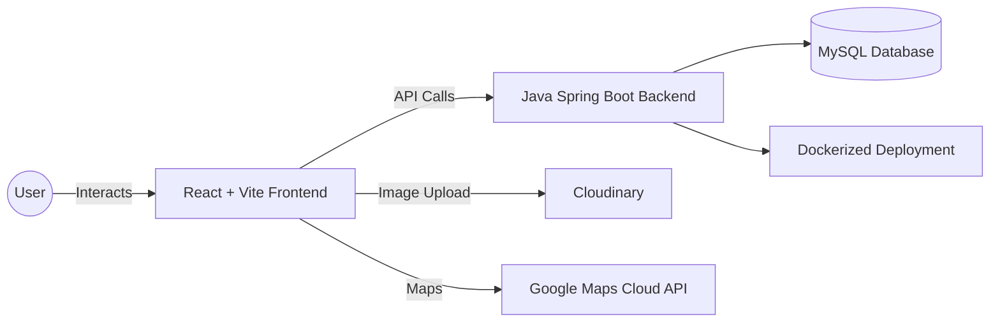

# BinFinder

**binFinder** is a community-driven platform that helps people easily **find**, **add**, and **share nearby waste bins**, making cities cleaner and smarter. It combines **location tracking** with **community contributions**, ensuring that bin locations are always up to date.

---

## ✨ Features

* 📍 **Find Bins Nearby** – View bins on an interactive **Google Maps** interface.
* ➕ **Add New Bins** – Contribute by adding new bin locations with details.
* 📷 **Upload Bin Photos** – Secure photo uploads powered by **Cloudinary**.
* 🔐 **User Profiles** – Track your contributions and manage your account.
* 🌍 **Community Collaboration** – Shared database of bin locations for everyone.

---

## 🛠️ Tech Stack

**Frontend:**

* React (Vite)
* Google Maps Cloud API

**Backend:**

* Java Spring Boot (REST APIs)
* MySQL Database

**Storage & Deployment:**

* Cloudinary (Image uploads)
* Docker (Containerized deployment)
* Vercel (Frontend hosting) + Cloud host for backend

---

## ⚙️ Architecture

## Login/SignUp page

## Home page

## Search page

## Profile page

